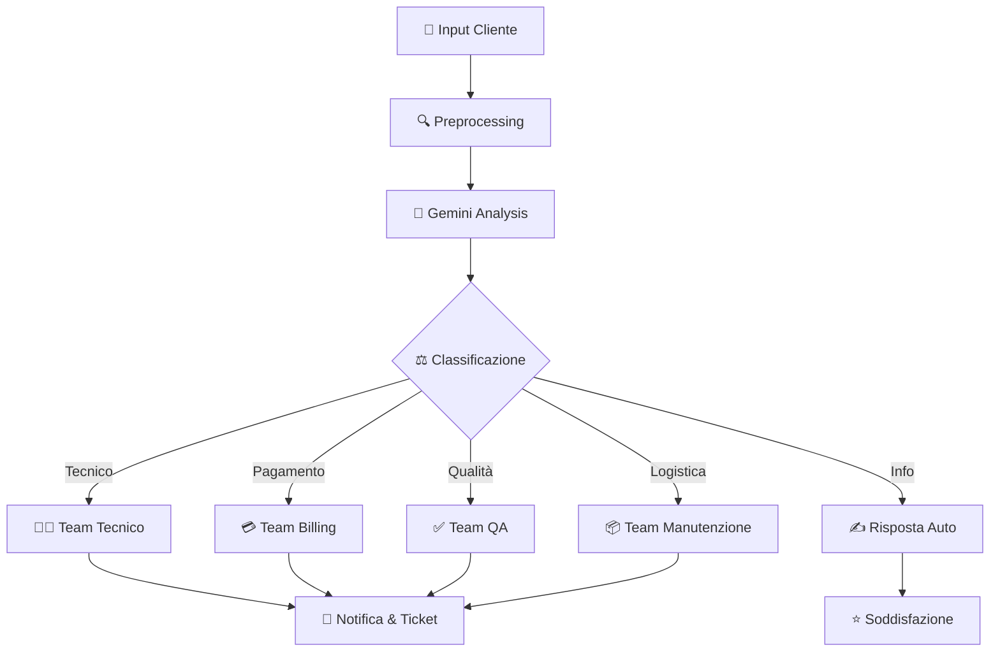

# 🎯 AI Vending Triage - Sistema di Routing Intelligente per Assistenza Clienti

**Agente di supporto IA intelligente per l'instradamento e la gestione delle richieste clienti nei distributori automatici**


## 📋 Descrizione

**AI Vending Triage** è un sistema intelligente di routing e classificazione delle richieste di supporto clienti, appositamente progettato per i distributori di macchine automatiche. Utilizza Google Gemini AI per:

- ✅ **Classificazione automatica** delle problematiche segnalate dai clienti
- 📞 **Instradamento intelligente** verso il team di supporto appropriato
- 🔍 **Analisi del contesto** per comprendere la natura della richiesta
- ⚡ **Risposta rapida** ai problemi comuni senza intervento umano
- 📊 **Tracciamento e gestione** delle segnalazioni
- 🌐 **Disponibilità multilingue** (Italiano, Inglese, ecc.)

### Casi d'Uso

- **Segnalazione Malfunzionamenti** - Rottura dispensatore, mancato cambio, prodotto incastrato
- **Problemi di Pagamento** - Transazioni fallite, denaro non restituito, errori di lettura
- **Richieste di Informazioni** - Ubicazione macchine, disponibilità prodotti, orari
- **Reclami Clienti** - Prodotto scaduto, qualità, igiene
- **Manutenzione Preventiva** - Segnalazione usura, prenotazione controlli
- **Refund e Rimborsi** - Gestione rimborsi e procedure di risarcimento

## 🏗️ Architettura del Sistema

```
┌──────────────────────────────────────┐
│   Interfaccia Cliente (Web/Mobile)   │
│     (React, Vue o Native App)        │
└──────────────┬───────────────────────┘
               │
    HTTP Request (Descrizione Problema)
               │
┌──────────────▼───────────────────────┐
│    API Gateway / Backend Node.js      │
│         Port: 3000 (Default)         │
└──────────────┬───────────────────────┘
               │
    ┌──────────┴──────────┐
    │                     │
    ▼                     ▼
┌────────────┐      ┌──────────────┐
│  Gemini    │      │  Database    │
│  LLM Agent │      │  (MongoDB/   │
│            │      │   PostgreSQL)│
│ - Analyze  │      │              │
│ - Classify │      │ - Store      │
│ - Route    │      │ - Query      │
└────────────┘      └──────────────┘
    │
    ▼
┌────────────────────────────────────┐
│   Routing Logic & Decision Engine   │
│                                    │
│  ┌─────────────────────────────┐  │
│  │ Support Team Assignment     │  │
│  │ - Technical Support         │  │
│  │ - Billing Department        │  │
│  │ - Quality Assurance         │  │
│  │ - Logistics/Maintenance     │  │
│  └─────────────────────────────┘  │
└────────────────────────────────────┘
    │
    ▼
┌──────────────────────────────────────┐
│   Notifica al Team di Supporto       │
│   (Email, Slack, CRM Integration)    │
└──────────────────────────────────────┘
```

## 🎯 Funzionalità Principali

### 1. **Classificazione Intelligente**
- Analisi in tempo reale del testo della segnalazione
- Identificazione automatica della categoria di problema
- Assegnazione di priorità (Alta/Media/Bassa)
- Rilevamento di parole chiave critiche

### 2. **Instradamento Automatico**
```
Segnalazione Ricevuta
    ├─ Problema Tecnico? → Team Tecnico
    ├─ Problema di Pagamento? → Bilancio
    ├─ Segnalazione Qualità? → QA
    ├─ Prodotto Incastrato? → Manutenzione
    └─ Richiesta Info? → Risposta Automatica
```

### 3. **Gestione Intelligente dei Ticket**
- Numerazione automatica e tracciamento
- Storico completo di ogni segnalazione
- Note e aggiornamenti in tempo reale
- Integrazione con sistemi CRM

### 4. **Analytics e Reporting**
- Dashboard con statistiche delle segnalazioni
- Trend analysis dei problemi più comuni
- Tempo medio di risoluzione
- KPI di soddisfazione clienti

## 📁 Struttura del Progetto

```
AI_Vending_Triage/
├── src/
│   ├── components/
│   │   ├── TriageForm.jsx          # Form di input segnalazione
│   │   ├── TicketList.jsx          # Lista ticket gestiti
│   │   ├── AnalysisPanel.jsx       # Panel analisi AI
│   │   └── RoutingDashboard.jsx    # Dashboard routing
│   │
│   ├── pages/
│   │   ├── index.jsx               # Home page
│   │   ├── dashboard.jsx           # Dashboard principale
│   │   └── admin.jsx               # Pannello amministrativo
│   │
│   ├── services/
│   │   ├── geminiService.js        # Integrazione Gemini API
│   │   ├── ticketService.js        # Gestione ticket
│   │   └── routingEngine.js        # Engine di routing
│   │
│   ├── utils/
│   │   ├── prompts.js              # Prompt template per Gemini
│   │   ├── categories.js           # Categorie predefinite
│   │   └── validators.js           # Validazione dati
│   │
│   └── App.jsx                     # Entry point principale
│
├── public/
│   ├── index.html
│   └── assets/
│
├── .env.local                      # Variabili d'ambiente
├── .env.example                    # Template variabili
├── package.json                    # Dipendenze Node.js
├── vite.config.js                  # Configurazione Vite
└── README.md                       # Questo file
```

## 🚀 Avvio Rapido

### Prerequisiti

- **Node.js 18.0.0+** - Download da [nodejs.org](https://nodejs.org/)
- **npm 9.0.0+** (incluso con Node.js)
- **Google Gemini API Key** - Gratis da [ai.google.dev](https://ai.google.dev)

### 1️⃣ Configurazione API Key

#### Ottenere la Google Gemini API Key

1. Visita [Google AI Studio](https://aistudio.google.com/)
2. Clicca su **"Create API Key"**
3. Copia la tua chiave API
4. Salva in un luogo sicuro

### 2️⃣ Installazione Locale

```bash
# Clona il repository
git clone https://github.com/EmanueleDeCandia/AI_Vending_Triage.git
cd AI_Vending_Triage

# Installa le dipendenze
npm install
```

### 3️⃣ Configurazione Variabili d'Ambiente

Crea un file `.env.local` nella root del progetto:

```bash
# API Configuration
VITE_GEMINI_API_KEY=your_gemini_api_key_here

# Server Configuration
VITE_API_URL=http://localhost:3000
VITE_APP_ENV=development

# Feature Flags
VITE_ENABLE_ANALYTICS=true
VITE_ENABLE_CRM_INTEGRATION=false
VITE_LANGUAGE=it
```

Oppure copia da template:
```bash
cp .env.example .env.local
# Poi modifica .env.local con i tuoi valori
```

### 4️⃣ Avvia l'Applicazione

```bash
# Sviluppo (con hot reload)
npm run dev

# Build per produzione
npm run build

# Preview della build
npm run preview
```

L'applicazione sarà disponibile su: **http://localhost:5173**

## 📖 Guida Utente

### Per i Clienti

#### Segnalare un Problema

1. **Accedi all'interfaccia di supporto**
2. **Descrivi il problema** in dettaglio:
   - Ubicazione della macchina (indirizzo o numero ID)
   - Tipo di problema riscontrato
   - Data e ora del verificarsi
   - Azioni già intraprese

3. **Sistema analizzerà** automaticamente:
   - La natura del problema
   - La priorità della segnalazione
   - Il team più adatto

4. **Riceverai conferma** con:
   - Numero di ticket
   - Categoria assegnata
   - Tempo stimato di risposta

#### Esempi di Segnalazioni

```
❌ "La macchina non funziona"
✅ "La macchina al centro commerciale (ID: VM-4521) non dispensa i prodotti dal primo scaffale. Ho inserito il denaro ma il dispensatore non risponde."

❌ "Ho un problema di pagamento"
✅ "Ho pagato 3€ con carta alla macchina in Via Roma 45, ma il prodotto non è stato erogato e nemmeno il denaro è stato restituito. Sono le 15:30."

❌ "Qualità scarsa"
✅ "Il caffè distributore all'università è freddo e ha un sapore strano. Sospetto sia scaduto."
```

### Per l'Admin Team

#### Dashboard di Gestione

1. **Monitora tutti i ticket** in tempo reale
2. **Visualizza statistiche** di categorizzazione
3. **Gestisci routing** manuale se necessario
4. **Esporta report** per analisi periodiche

#### Integrazione Slack (opzionale)

```bash
# Configura webhook Slack per ricevere notifiche
VITE_SLACK_WEBHOOK_URL=https://hooks.slack.com/services/YOUR/WEBHOOK/URL
```

## 🧠 Come Funziona il Triage IA

### Processo Passo-Passo



### Configurazione Prompt Gemini

Il sistema utilizza prompt intelligenti per:

```javascript
// Esempio di prompt per classificazione
const classificationPrompt = `
Analizza il seguente problema segnalato da un cliente di distributori automatici
e classifica in una di queste categorie:

Categorie possibili:
- TECHNICAL: Problemi di funzionamento (mancata erogazione, dispensazione, errori)
- PAYMENT: Problemi di pagamento (transazioni fallite, denaro non restituito)
- QUALITY: Problemi di qualità (prodotto scaduto, contaminazione, aspetto)
- LOGISTICS: Richieste logistiche (manutenzione, restock, riparazione)
- INFO: Richieste informazioni (ubicazione, orari, disponibilità)
- REFUND: Richieste di rimborso o risarcimento

Problema: "${userInput}"

Fornisci risposta in JSON con:
- category: categoria identificata
- priority: alta/media/bassa
- reasoning: motivo della classificazione
- suggestedTeam: team di supporto consigliato
`;
```

## 🔧 Configurazione Avanzata

### Variabili d'Ambiente Complete

```bash
# === GEMINI API ===
VITE_GEMINI_API_KEY=sk-proj-xxxxxxxxxxxxx

# === DATABASE ===
VITE_DB_TYPE=mongodb  # mongodb | postgresql
VITE_DB_URL=mongodb://localhost:27017/vending_triage
VITE_DB_USER=admin
VITE_DB_PASSWORD=secure_password

# === SERVER ===
VITE_API_PORT=3000
VITE_API_URL=http://localhost:3000
VITE_CORS_ORIGIN=http://localhost:5173

# === NOTIFICATIONS ===
VITE_SLACK_WEBHOOK_URL=https://hooks.slack.com/services/...
VITE_EMAIL_SERVICE=sendgrid  # sendgrid | mailgun
VITE_SENDGRID_API_KEY=SG.xxxxxxxxxxxx

# === CRM INTEGRATION ===
VITE_CRM_TYPE=salesforce  # salesforce | hubspot | pipedrive
VITE_CRM_API_KEY=xxxxxxxxxxxxx

# === ANALYTICS ===
VITE_ANALYTICS_ENABLED=true
VITE_MIXPANEL_TOKEN=xxxxxxxxxxxxx

# === APP CONFIG ===
VITE_APP_ENV=production  # development | staging | production
VITE_LOG_LEVEL=info  # debug | info | warn | error
VITE_LANGUAGE=it  # it | en | es | fr
```

### Personalizzazione Categorie

Modifica `src/utils/categories.js`:

```javascript
export const CATEGORIES = {
  TECHNICAL: {
    name: "Problema Tecnico",
    priority: "alta",
    teams: ["technical-support", "field-service"],
    keywords: ["non funziona", "errore", "mancata erogazione"],
    responseTime: "2 ore"
  },
  PAYMENT: {
    name: "Problema di Pagamento",
    priority: "alta",
    teams: ["billing", "finance"],
    keywords: ["pagamento fallito", "denaro", "carta non funziona"],
    responseTime: "4 ore"
  },
  // ... altre categorie
};
```

## 📊 Metriche e Analytics

### KPI Principali Tracciati

| Metrica | Descrizione |
|---------|-------------|
| **Ticket Volume** | Numero di segnalazioni ricevute per periodo |
| **Avg Resolution Time** | Tempo medio di risoluzione per categoria |
| **First Response Time** | Tempo dalla segnalazione alla prima risposta |
| **Customer Satisfaction** | Rating medio clienti (1-5 stelle) |
| **Auto-Resolution Rate** | % Problemi risolti automaticamente |
| **Routing Accuracy** | % Ticket instradati al team corretto |
| **Peak Hours** | Orari con maggior volume di segnalazioni |
| **Top Issues** | Problemi più frequenti segnalati |

### Dashboard Analytics

Accedi a: `/dashboard/analytics`

```
┌─────────────────────────────────────────┐
│  AI Vending Triage - Analytics Board    │
├─────────────────────────────────────────┤
│                                         │
│  📊 Segnalazioni Oggi: 47               │
│  📈 Trend: +12% vs ieri                 │
│  ⏱️  Tempo Medio Risoluzione: 3.2 ore   │
│  ⭐ Soddisfazione Cliente: 4.6/5        │
│                                         │
│  ┌─ Distribuzione per Categoria ────┐  │
│  │ Tecnico:     ████████░░ 48%      │  │
│  │ Pagamento:   ██████░░░░ 28%      │  │
│  │ Qualità:     ████░░░░░░ 15%      │  │
│  │ Logistica:   ███░░░░░░░ 9%       │  │
│  └────────────────────────────────┘  │
│                                         │
└─────────────────────────────────────────┘
```

## 🐛 Troubleshooting

### Errore: "API Key non valida"

```
❌ Error: Invalid API Key
```

**Soluzione:**
1. Verifica di aver copiato correttamente la API key da AI Studio
2. Controlla che sia in `.env.local` e non in `.env.example`
3. Riavvia il server `npm run dev`
4. Pulisci la cache del browser

### Errore: "Connessione al database rifiutata"

```
❌ MongooseError: Cannot connect to MongoDB
```

**Soluzione:**
1. Verifica che MongoDB sia in esecuzione (se usi MongoDB locale)
2. Controlla la stringa di connessione in `.env.local`
3. Verifica credenziali database
4. Aumenta il timeout di connessione

### Errore: "CORS Error"

```
❌ Access to XMLHttpRequest blocked by CORS policy
```

**Soluzione:**
1. Verifica `VITE_CORS_ORIGIN` in `.env.local`
2. Assicurati che l'URL frontend sia in whitelist
3. Riavvia il backend

## 🚢 Deploy in Produzione

### Opzione 1: Deploy su Vercel

```bash
# Installa Vercel CLI
npm install -g vercel

# Deploy
vercel

# Con variabili d'ambiente
vercel --env-file=.env.production
```

### Opzione 2: Deploy su Netlify

```bash
# Build locale
npm run build

# Deploy manuale su Netlify
# 1. Vai a netlify.com
# 2. Crea nuovo sito
# 3. Carica cartella 'dist'
# 4. Configura variabili d'ambiente
```

### Opzione 3: Deploy su Cloud Run (Google Cloud)

```bash
# Crea Dockerfile
cat > Dockerfile << EOF
FROM node:18-alpine
WORKDIR /app
COPY . .
RUN npm install && npm run build
EXPOSE 3000
CMD ["npm", "run", "preview"]
EOF

# Deploy
gcloud run deploy ai-vending-triage \
  --source . \
  --platform managed \
  --region europe-west1
```

## 📱 Integrazione API

### Endpoint Principal

```bash
# Invia una nuova segnalazione
POST /api/tickets
Content-Type: application/json

{
  "description": "La macchina al centro commerciale non dispensa",
  "location": "Via Roma 45, Milano",
  "machineId": "VM-4521",
  "contactEmail": "cliente@example.com",
  "priority": "high"
}

# Risposta
HTTP/1.1 201 Created
{
  "ticketId": "TICKET-2024-001547",
  "category": "TECHNICAL",
  "assignedTeam": "technical-support",
  "estimatedResponseTime": "2 hours",
  "status": "OPEN"
}
```

## 🔐 Sicurezza

### Best Practices Implementate

- ✅ Validazione input lato client e server
- ✅ Sanitizzazione dati prima dell'analisi IA
- ✅ Rate limiting per prevenire abuse
- ✅ Encryption dati sensibili
- ✅ JWT per autenticazione
- ✅ HTTPS obbligatorio in produzione
- ✅ CORS configurato rigorosamente
- ✅ Logging di tutte le operazioni

### Checklist Sicurezza Pre-Deploy

- [ ] Variabili sensibili in `.env.production`
- [ ] HTTPS abilitato
- [ ] CORS whitelist configurato
- [ ] Rate limiting attivo
- [ ] Backup database pianificati
- [ ] SSL certificate valido
- [ ] Monitoring e alerting attivo

## 🧪 Testing

```bash
# Test unitari
npm run test

# Test integrazione
npm run test:integration

# Test end-to-end
npm run test:e2e

# Coverage
npm run test:coverage
```

## 📚 Documentazione Aggiuntiva

- [Google Gemini API Docs](https://ai.google.dev/docs)
- [Vite Documentation](https://vitejs.dev/)
- [React Documentation](https://react.dev/)
- [Node.js API Documentation](https://nodejs.org/api/)

## 🛣️ Roadmap

### v1.1 (Q3 2026)
- [ ] Supporto multilingue completo (IT, EN, ES, FR, DE)
- [ ] Dashboard real-time con WebSocket
- [ ] Integrazione Slack nativa
- [ ] API pubblica per partner

### v1.2 (Q4 2026)
- [ ] Machine Learning per miglioramento accuratezza
- [ ] Chatbot interattivo pre-triage
- [ ] Mobile app iOS/Android
- [ ] Integrazioni CRM (Salesforce, HubSpot)

### v2.0 (2027)
- [ ] Predictive maintenance alerts
- [ ] Computer vision per analisi fotografica
- [ ] Voice support integration
- [ ] Advanced analytics e forecasting

## 📞 Supporto e Contatti

### Segnalare Bug

1. Visita [GitHub Issues](../../issues)
2. Controlla se il bug è già stato segnalato
3. Crea un nuovo issue con:
   - Descrizione del problema
   - Step per riprodurre
   - Output atteso vs effettivo
   - Screenshot/video se rilevante

### Richiedere Feature

Apri un issue con label `enhancement` spiegando:
- Quale feature desideri
- Perché è utile
- Come dovrebbe funzionare

### Contattaci Direttamente

- 📧 Email: support@your-domain.com
- 💬 Discord: [Unisciti al server](https://discord.gg/your-invite)
- 🐦 Twitter: [@VendingAI](https://twitter.com/your-handle)

## 📄 Licenza

Questo progetto è licenziato sotto la MIT License - vedi il file [LICENSE](LICENSE) per i dettagli.

## 👥 Contribuire

Le contribuzioni sono benvenute! Per favore:

1. **Fork** il repository
2. Crea un **feature branch** (`git checkout -b feature/amazing-feature`)
3. **Commit** i tuoi cambiamenti (`git commit -m 'Add amazing feature'`)
4. **Push** al branch (`git push origin feature/amazing-feature`)
5. Apri una **Pull Request**

## 🙏 Ringraziamenti

- Google Gemini Team per l'API IA
- Community Node.js e React
- Tutti i contributori e tester beta

---

**Creato con ❤️ per migliorare l'assistenza ai clienti dei distributori automatici**

*Ultimo aggiornamento: Giugno 2026*

---

### Quick Links
- 🌐 [Website](https://www.your-domain.com)
- 📖 [Documentazione Completa](./docs)
- 🐛 [Report Bug](../../issues/new?labels=bug)
- 💡 [Suggerisci Feature](../../issues/new?labels=enhancement)
- 💬 [Discussioni](../../discussions)
